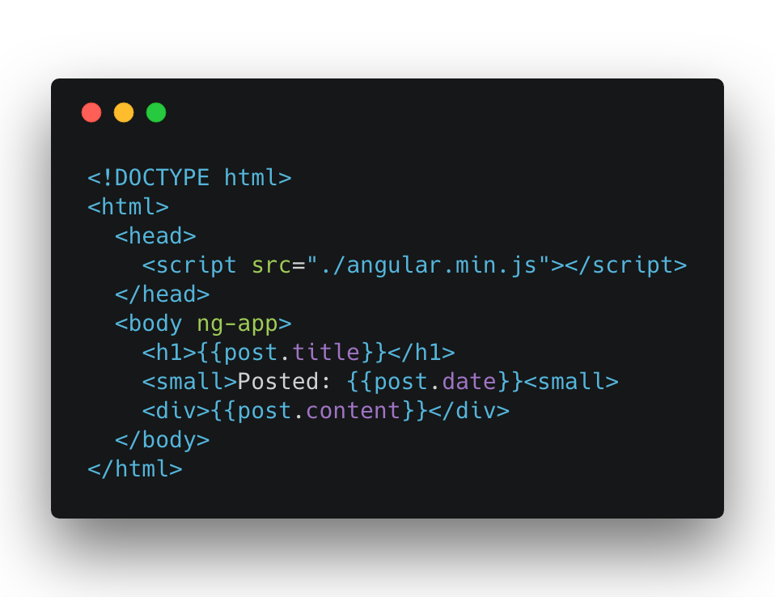
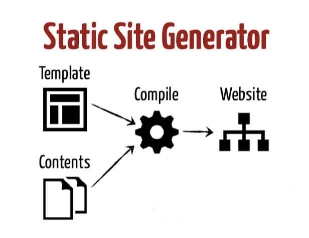
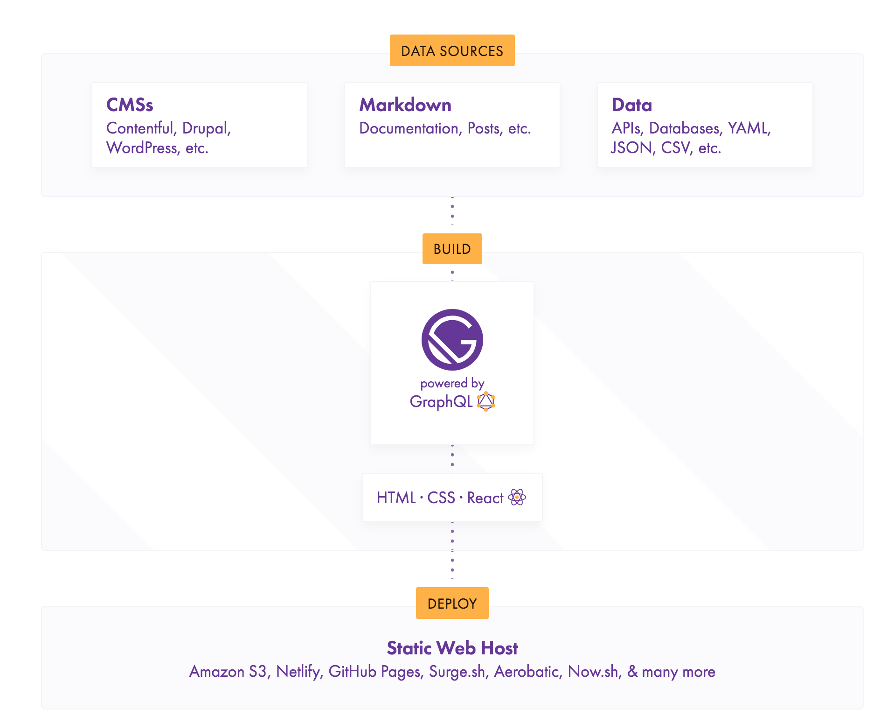

import { Head } from 'mdx-deck'
import Social from './social'
import AppearLink from './AppearLink'
import { Appear } from 'mdx-deck'
import { Image } from 'mdx-deck'
export { default as theme } from './theme'
import { Split } from 'mdx-deck/layouts'
import styled, {css} from 'styled-components'
import { FullScreenCode } from 'mdx-deck/layouts'
import ClickCode from './ClickCode'

<Head>
  <title>Static sites with Gatsby</title>
  <link href="https://fonts.googleapis.com/css?family=Galindo" rel="stylesheet"/>
</Head>

# Static sites with Gatsby

### by Geoffrey Hunt

<Social/>

<br/>


---

# Me

- Freelance developer
- 😍 javascript
- maker 🏗️ 🖨️
- I Run for fun ?
- Twitter [@geoff4l](https://twitter.com/geoff4l)
- Blog [runningdeveloper.com](https://runningdeveloper.com)

```notes
- running helps me focus and get away from the computer
```

---

export default Split


---

# Talk

- Why Gatsby JS with a story mode
- Gatsby 😍
- Demo 😟

---

# Stuff I've tried
## Road to Gatsby based a little bit on my blog

---
export default Split


- Server for DB, php
- Maintenance
- Cost
- Tough to make fast

```notes
- New nothing at the time
- Shared hosting sucked
- Tried running ec2 server, Maintenance and probably serious security holes
- But I love wordpress, they made tons of developers and starting point for many, they even do some crazy react stuff and the api is game changer
- Cheaper
- Easier
```

---

export default Split


- Cool no server, no DB (*s3)
- Blank screen js load
- no SEO, no sharing



```notes
- Getting first internship learning angularjs (version 1)
- I can do anything in JS
- No server or DB
- Blank screen till js loads
- curl website, u get no seo or sharing things on facebook and etc (I know there are ways fo fix this)
```

---

export default Split

<ClickCode image="images/gulp.png" imageTwo="images/gulp_code.png"/>

- Cool no server, no DB (*s3)
- SEO and sharing
- Static html
- Cheap and fast
- Way to complex always breaking
- Didn't need to reinvent the wheel

```notes
- Gulp is a build tool that pipes files through functions to transform
- Gulp made sense to me 
- First static site generator, outputting plain html, css and some js for fancy stuff
- I really didn't need some much custom code, this has been solved before
```
---

# Static sites?

- No servers (hey @pjapplez), serve only static content
- No backend database layer
- Speed (CDN)
- Low cost
- Static site generators (Jekyll, hexo, hugo, wintersmith, Gatsby)


```notes
- html css and js
- not like the old days - js frameworks you do a lot with frontend js

JavaScript, APIs, Markup

- Running on the client js
- Use services via APIs (thirdparty stuff)
- Markup done at build time using generator tools 

```

---



---

export default Split


- Cool no server, no DB (*s3)
- SEO and sharing
- Markdown files
- Cheap and Fast
- Plugins to solve tasks
- Focus on theme/presentation only
- Cool js stuff u can only load up afterwards

```notes
- All awesome
- I want to be able to use something like angular/react
- Not seemless from js, theme to what gets made 
```

---

# Finally Gatsby
## I can write React
### Static site generator (no server!)
### It gets me a great lighthouse score?


---

export default Split

- Use React and GraphQl
- Static site generator
- Take any data source
- Does magic with webpack
- Loads of community plugins
- Version 2 just released



---

# Demo


---

export default FullScreenCode

```
$ npm install --global gatsby-cli
$ gatsby new demo-site 
\\ https://github.com/gatsbyjs/gatsby-starter-default
```

```notes

- Version 2
- CSS in JS
- Great docs
- Plugins
- Image thing
- GraphQl
- Application type route

```
---

# Other players

- [VuePress](https://vuepress.vuejs.org/) (Vue)
- [NEXT.js](https://nextjs.org/#static-exporting) (React static exporting)
- many more [https://www.staticgen.com/](https://www.staticgen.com/)

---


<Social/>


```notes
- Create speaker notes in fenced code blocks
```
